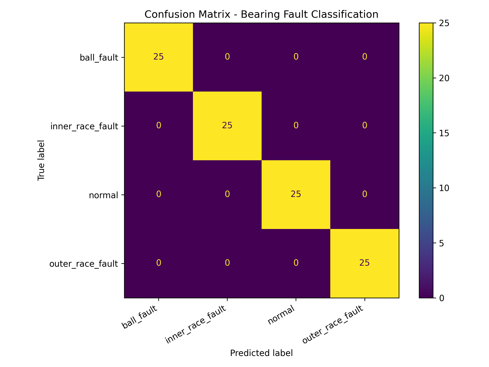
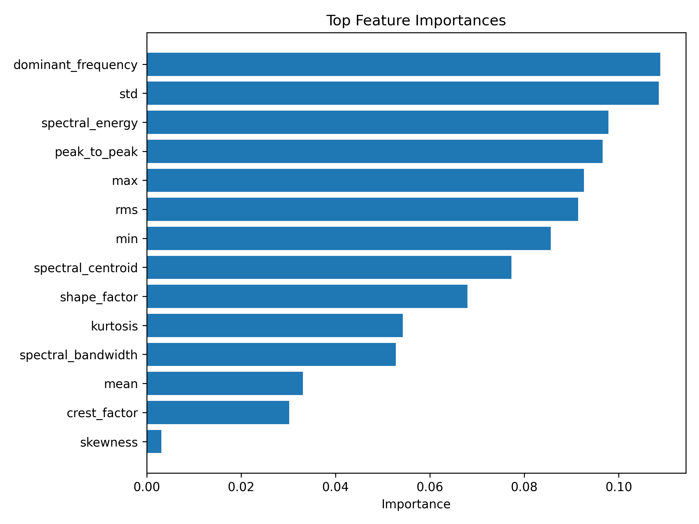

# Sensor Predictive Maintenance

This project develops a machine learning workflow for classifying bearing condition from vibration sensor data. It is designed as an applied AI/ML portfolio project focused on industrial sensor data, feature extraction, model development, testing, validation, and predictive maintenance.

## Motivation

Industrial equipment often produces vibration signals that contain useful information about machine health. Detecting abnormal vibration patterns can help identify bearing faults and support predictive-maintenance workflows.

This project uses bearing vibration data to classify equipment condition into four classes:

- normal
- inner race fault
- ball fault
- outer race fault

## Dataset

This project uses the Case Western Reserve University bearing vibration dataset.

The dataset is not included in this repository because the raw `.mat` files are external data files. Download instructions are provided in:

```text
data/README.md
```

For the first baseline version, four `.mat` files are used:

| Class | File |
|---|---|
| normal | 97.mat |
| inner race fault | 105.mat |
| ball fault | 118.mat |
| outer race fault | 130.mat |

## Methods

The current pipeline includes:

1. Loading MATLAB `.mat` vibration files
2. Selecting the drive-end vibration signal
3. Segmenting each vibration signal into fixed-length windows
4. Extracting time-domain and frequency-domain features
5. Training a Random Forest baseline classifier
6. Evaluating the model with classification metrics and a confusion matrix
7. Saving feature-importance results
8. Running file-level prediction using aggregated window predictions
9. Adding basic tests for data loading, feature extraction, and prediction output

## Extracted Features

The first version uses manually engineered vibration features.

Time-domain features:

- mean
- standard deviation
- RMS
- minimum
- maximum
- peak-to-peak value
- skewness
- kurtosis
- crest factor
- shape factor

Frequency-domain features:

- dominant frequency
- spectral centroid
- spectral bandwidth
- spectral energy

## Project Structure

```text
sensor-predictive-maintenance/
├── data/
│   └── README.md
├── docs/
│   └── model_card.md
├── notebooks/
├── results/
├── src/
│   ├── data_loader.py
│   ├── features.py
│   ├── train.py
│   ├── evaluate.py
│   └── predict.py
├── tests/
│   ├── test_data_loader.py
│   ├── test_features.py
│   └── test_prediction_output.py
├── requirements.txt
└── README.md
```

## How to Run

### 1. Create and activate a virtual environment

```bash
python -m venv .venv
source .venv/Scripts/activate
```

### 2. Install dependencies

```bash
pip install -r requirements.txt
```

### 3. Inspect a MATLAB data file

```bash
python src/inspect_mat_file.py
```

### 4. Build feature table preview

```bash
python src/features.py
```

This creates:

```text
results/feature_preview.csv
```

### 5. Train the baseline model

```bash
python src/train.py
```

This creates:

```text
models/baseline_random_forest.joblib
results/metrics.json
results/classification_report.txt
results/feature_columns.json
```

### 6. Evaluate the model

```bash
python src/evaluate.py
```

This creates:

```text
results/confusion_matrix.png
results/evaluation_summary.json
results/evaluation_summary.txt
results/feature_importance.csv
results/feature_importance.png
```

### 7. Predict one file

```bash
python src/predict.py --file data/raw/cwru/normal/97.mat
```

Example output:

```text
Predicted label: normal
```

### 8. Run tests

```bash
pytest
```

If needed:

```bash
PYTHONPATH=. pytest
```

## Current Results

The first baseline Random Forest model produced perfect classification on the initial four-file dataset.

This result should be interpreted carefully. The current baseline uses a window-level random train/test split, which is useful for checking that the full pipeline works, but it can overestimate performance because windows from the same original vibration signal may be highly similar.

### Confusion Matrix



### Feature Importance



The strongest features in the first baseline include dominant frequency, standard deviation, spectral energy, peak-to-peak amplitude, maximum value, and RMS. This is physically reasonable because bearing faults often change both vibration amplitude and frequency content.

Current result files:

```text
results/confusion_matrix.png
results/feature_importance.png
results/classification_report.txt
results/metrics.json
```

## Validation Note

The current baseline is a first development version. It is not yet a fully leakage-aware industrial validation.

Detailed validation and experiment plans are documented here:

```text
docs/validation_strategy.md
docs/experiment_plan.md
```

Main limitation:

- Windows from the same original `.mat` signal can appear in both training and test sets.

This can make the classification task easier than a real deployment scenario.

Planned improvement:

- evaluate across different files, fault sizes, or operating/load conditions
- compare performance under more realistic train/test splits
- add more data files from the CWRU dataset
- compare feature-based models with a simple 1D CNN
- add stronger data validation and model-behaviour tests

## Testing

Basic tests are included for:

- dataset folder structure
- `.mat` file loading
- label extraction
- signal windowing
- feature extraction
- prediction output structure

Run:

```bash
pytest
```

## Model Type

Current baseline:

```text
RandomForestClassifier
```

This model was chosen because it is a strong classical baseline for tabular features and provides feature-importance estimates.

## Limitations

This project is for applied learning and portfolio demonstration. It is not intended for real industrial maintenance decisions without:

- more diverse operating conditions
- leakage-aware validation
- testing on unseen machines
- sensor calibration checks
- deployment-specific monitoring
- domain expert review


## Experiment Roadmap

Planned experiment stages:

1. Baseline Random Forest model on engineered vibration features
2. Classical model comparison: Logistic Regression, Random Forest, SVM, and gradient boosting
3. Feature ablation: time-domain vs frequency-domain vs combined features
4. Leakage-aware file-level validation
5. Load-condition generalization
6. Fault-size generalization
7. Raw-signal 1D CNN comparison

The focus is not only on improving accuracy, but on making the validation more realistic and industrially meaningful.


## Future Improvements

Planned extensions:

- expand to more CWRU files and fault diameters
- implement leakage-aware train/test splitting
- compare Random Forest, SVM, XGBoost, and 1D CNN models
- add signal plots and FFT visualizations
- add model monitoring reports
- build a simple inference demo
- connect the validation utilities from the ML testing and validation toolkit
