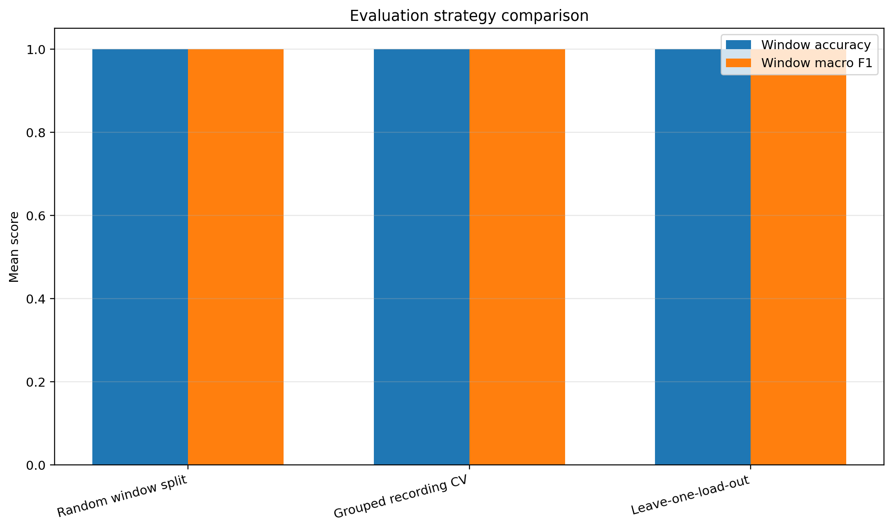
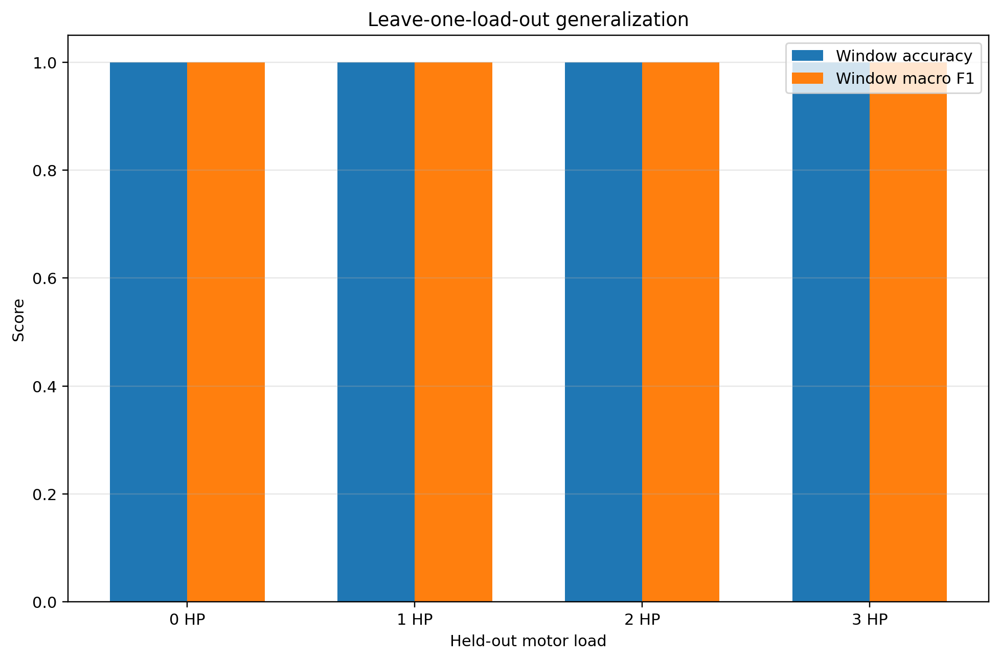

# Sensor Predictive Maintenance

## Summary

A reproducible bearing-fault classification pipeline using vibration data from the Case Western Reserve University dataset.
The current benchmark uses 16 source recordings covering four bearing conditions and four motor loads.
It standardizes signals to 12 kHz, extracts 14 engineered time- and frequency-domain features from balanced windows, trains a Random Forest classifier, and compares three evaluation designs.

## Why This Upgrade Matters

A random window split can place windows from one source recording in both training and testing.
This project therefore reports the random-window baseline alongside recording-grouped cross-validation and leave-one-load-out evaluation.
The grouped and unseen-load evaluations explicitly enforce zero source-recording overlap.

## Benchmark

| Property | Value |
| --- | ---: |
| Source recordings | 16 |
| Classes | 4 |
| Motor loads | 0, 1, 2, and 3 HP |
| Windows | 800 |
| Windows per recording | 50 |
| Window size | 2,048 samples |
| Window step | 1,024 samples |
| Effective sample rate | 12 kHz |
| Model features | 14 |

Classes:

- normal
- inner-race fault
- ball fault
- outer-race fault

The versioned dataset manifest is stored at `data/manifests/cwru_load_benchmark.csv`.
Raw `.mat` files remain local and are excluded from Git.

## Evaluation Results

| Evaluation strategy | Accuracy | Macro F1 | Maximum overlapping source recordings |
| --- | ---: | ---: | ---: |
| Random window split | 1.000 | 1.000 | 16 |
| Grouped recording CV | 1.000 | 1.000 | 0 |
| Leave-one-load-out | 1.000 | 1.000 | 0 |

All four held-out motor loads tied at 1.000 accuracy and 1.000 macro F1.

The key methodological result is that grouped recording and leave-one-load-out evaluation both use zero overlapping source recordings, while the random-window baseline contains all 16 source recordings in both training and test data.

Detailed metrics, per-class results, recording-level predictions, confusion matrices, and limitations are documented in [`docs/leakage_aware_evaluation.md`](docs/leakage_aware_evaluation.md).

## Pipeline

1. Read the versioned dataset manifest.
2. Download and verify 16 MATLAB recordings.
3. Resample normal recordings from 48 kHz to 12 kHz.
4. Select 50 evenly distributed windows per recording.
5. Extract 14 time- and frequency-domain features.
6. Train a class-weighted Random Forest with 200 trees.
7. Run random-window, grouped-recording, and leave-one-load-out evaluation.
8. Aggregate window probabilities into recording-level predictions.
9. Generate CSV, JSON, text, and image reports.
10. Validate split integrity and committed result artifacts.

## Reproduce the Leakage-Aware Experiment

Run these commands from the repository root:

    python scripts/download_cwru_load_benchmark.py
    python scripts/build_cwru_load_features.py
    python scripts/run_leakage_aware_evaluation.py
    python scripts/generate_leakage_aware_report.py
    python src/validate_leakage_aware_results.py
    pytest

The automated tests use synthetic signals and temporary MATLAB files, so CI does not need the external CWRU dataset.

## Main Outputs

- `results/leakage_aware_evaluation/strategy_comparison.csv`
- `results/leakage_aware_evaluation/fold_metrics.csv`
- `results/leakage_aware_evaluation/window_predictions.csv`
- `results/leakage_aware_evaluation/recording_predictions.csv`
- `results/leakage_aware_evaluation/per_class_metrics.csv`
- `results/leakage_aware_evaluation/analysis_summary.json`
- `docs/leakage_aware_evaluation.md`

## Testing and Validation

The test suite covers manifest parsing, MATLAB loading, sample-rate standardization, window selection, feature extraction, split invariants, recording-level aggregation, report generation, tied-result handling, and reusable validation-toolkit integration.

Run:

    pytest

## Limitations

The perfect benchmark scores do not establish production readiness.

- All recordings come from one laboratory test rig.
- The benchmark uses only the 0.007-inch fault diameter.
- Only the 6 o'clock outer-race position is included.
- Normal and fault recordings originated from different sampling configurations.
- Resampling cannot remove every acquisition-domain difference.
- No independent machine or external bearing dataset has been tested.
- No sensor drift, calibration, maintenance-cost, or deployment monitoring study is included.

## Next Experiments

1. Fault-diameter generalization with an unseen severity.
2. Time-domain versus frequency-domain feature ablation.
3. Comparison with one additional classical model.
4. Controlled noise, amplitude-scaling, and filtering tests.
5. CPU latency, memory, and saved-model-size benchmarking.
6. Comparison with a compact raw-signal model.

## Reusable Validation Toolkit

The project integrates [`ml-testing-validation-toolkit`](https://github.com/sakthi-kr/ml-testing-validation-toolkit) for reusable feature-table and model-output checks.
Leakage-specific invariants are implemented directly in this repository because they depend on source-recording and motor-load metadata.
